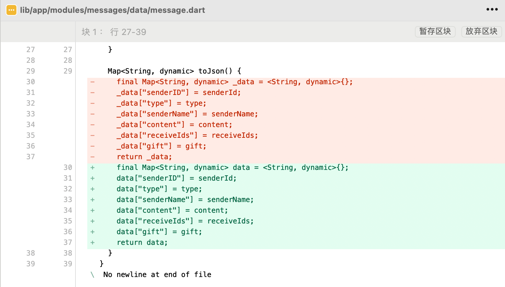

# jobs_flutter_base_config
## **前言**

* 每个项目工程里面都加入`双击运行.command`。方便启动项目

  ```shell
  #! /bin/sh
  
  # 获取当前脚本文件的目录
  current_directory=$(dirname "$(readlink -f "$0")")
  echo $current_directory
  cd $current_directory
  # 打开iOS模拟器
  open -a Simulator
  # 用VSCode打开项目
  code .
  ```

* Flutter项目的命名**只能字母全小写**，不能有大写。单词之间用`__`进行分隔

* Flutter项目没有和xcode项目一样的目录索引（`*.xcodeproj`）结构，所以在引入头文件的时候，需要带上路径
  * 如果是xcode项目，那么编译文件是根据目录索引文件（`*.xcodeproj`）来的。有些时候在进行代码git拉取合并的时候，或者对项目结构（文件先后顺序，文件夹包含关系等）做调整的时候，可能会出现目录文件不同步的情况，可能会导致一些异常，这样中心化的管理方式就比较落后。一个文件是否包含在项目里面进入编译期，是根据目录文件决定的。也就是以用xcode编辑器进行编辑，但是并不包含在项目工程打包的编译期间内
  * 去中心化。没有特定的目录文件，编辑器只会在打包的时候，对Flutter的几个关键命名的文件夹进行索取。里面包含的文件通过带路径的方式，就避免了中心化目录文件的问题
  
* 如果更新了Flutter SDK，那么再次进入项目的时候，编译器会执行初始化操作👇🏻

  ```shell
  Building flutter tool...
  Resolving dependencies...
  Got dependencies.
  Flutter assets will be downloaded from https://storage.flutter-io.cn. Make sure you trust this source!
  Downloading package sky_engine...                                   6.5s
  Downloading flutter_patched_sdk tools...                           545ms
  Downloading flutter_patched_sdk_product tools...                   423ms
  Downloading darwin-arm64 tools...                                  11.3s
  Downloading darwin-arm64 tools...                                  48.4s
  Downloading darwin-arm64/font-subset tools...                    2,160ms
  [✓] Flutter (Channel stable, 3.19.6, on macOS 14.4.1 23E224 darwin-arm64, locale zh-Hans-US)
      • Flutter version 3.19.6 on channel stable at /Users/jobs/Documents/GitHub/Flutter.SDK/flutter
      • Upstream repository https://github.com/flutter/flutter.git
      • Framework revision 54e66469a9 (2 周前), 2024-04-17 13:08:03 -0700
      • Engine revision c4cd48e186
      • Dart version 3.3.4
      • DevTools version 2.31.1
      • Pub download mirror https://pub.flutter-io.cn
      • Flutter download mirror https://storage.flutter-io.cn
  
  [✓] Android toolchain - develop for Android devices (Android SDK version 34.0.0)
      • Android SDK at /Users/jobs/Library/Android/sdk
      • Platform android-34, build-tools 34.0.0
      • ANDROID_HOME = /Users/jobs/Library/Android/sdk
      • Java binary at: /Applications/Android Studio.app/Contents/jbr/Contents/Home/bin/java
      • Java version OpenJDK Runtime Environment (build 17.0.9+0-17.0.9b1087.7-11185874)
      • All Android licenses accepted.
  
  [✓] Xcode - develop for iOS and macOS (Xcode 15.3)
      • Xcode at /Applications/Xcode.app/Contents/Developer
      • Build 15E204a
      • CocoaPods version 1.15.2
  
  [✓] Chrome - develop for the web
      • Chrome at /Applications/Google Chrome.app/Contents/MacOS/Google Chrome
  
  [✓] Android Studio (version 2023.2)
      • Android Studio at /Applications/Android Studio.app/Contents
      • Flutter plugin can be installed from:
        🔨 https://plugins.jetbrains.com/plugin/9212-flutter
      • Dart plugin can be installed from:
        🔨 https://plugins.jetbrains.com/plugin/6351-dart
      • Java version OpenJDK Runtime Environment (build 17.0.9+0-17.0.9b1087.7-11185874)
  
  [✓] VS Code (version 1.88.1)
      • VS Code at /Applications/Visual Studio Code.app/Contents
      • Flutter extension version 3.88.0
  
  [✓] Connected device (3 available)
      • iPhone (mobile) • 00008110-000625583EE3801E • ios            • iOS 17.4.1 21E236
      • macOS (desktop) • macos                     • darwin-arm64   • macOS 14.4.1 23E224 darwin-arm64
      • Chrome (web)    • chrome                    • web-javascript • Google Chrome 124.0.6367.93
  
  [✓] Network resources
      • All expected network resources are available.
  
  • No issues found!
  exit code 0
  ```

*这个时候如果强行运行代码，会得到编译器的提示*

```shell
Waiting for another flutter command to release the startup lock...
```

### Android Studio

* [] ()
* [**Android Studio 下载文件归档**](https://developer.android.com/studio/archive?hl=zh-cn)

### JavaSDK For Android in MacOS

* 因为Android基于Java，在使用[**Android Studio**](https://developer.android.com/studio?gad_source=1&gclid=Cj0KCQjwjLGyBhCYARIsAPqTz1-nhemrLBKyuxMDS0L2xhHGvrNdfmH3N9GZcy97GcrwbpZuIiCQ_c4aAm14EALw_wcB&gclsrc=aw.ds&hl=zh-cn)作为IDE进行编辑项目的时候，可能会对项目环境存在有Java环境的依赖

* 某些第三方包、[**Android Studio**](https://developer.android.com/studio?gad_source=1&gclid=Cj0KCQjwjLGyBhCYARIsAPqTz1-nhemrLBKyuxMDS0L2xhHGvrNdfmH3N9GZcy97GcrwbpZuIiCQ_c4aAm14EALw_wcB&gclsrc=aw.ds&hl=zh-cn)生成的IDE文件，亦可能对项目环境存在有Java环境的依赖

* [**Oracle.JavaSDK**](https://www.oracle.com/ph/java/technologies/downloads/)安装，略

* 推荐 [**OpenJDK**](https://openjdk.org/)（**Open** **J**ava **D**evelopment **K**it），是 Java 平台标准版（Java SE）的开源实现。它由 Oracle 主导开发，但也有其他公司和个人的贡献。OpenJDK 提供了一个免费的、开源的 Java 开发环境，涵盖了开发和运行 Java 应用程序所需的所有组件。

  * 安装制定版本的[**JavaSDK**](https://www.openlogic.com/openjdk-downloads?field_java_parent_version_target_id=416&field_operating_system_target_id=431&field_architecture_target_id=391&field_java_package_target_id=All) 

    * ```shell
      #! /bin/sh
      
      # 安装 SDKMAN
      curl -s "https://get.sdkman.io" | bash
      source "$HOME/.sdkman/bin/sdkman-init.sh"
      # 利用SDKMAN，查询可用的Java版本号
      sdk list java
      
      # 安装最新版本的 JDK
      sdk install java
      # 安装JDK8
      sdk install java 8.0.292-open 
      # 安装JDK11
      sdk install java 11.0.11-open
      
      # 将 OpenJDK 8 设置为默认的 Java 版本
      sdk default java 8.0.292-open
      
      # 验证安装
      java -version
      ```

      ```shell
      #! /bin/sh
      
      # 随时切换 Java 版本
      sdk use java 11.0.11-open
      # 查看当前使用的 Java 版本
      sdk current java
      ```

      *查看利用 OpenJDK 安装的 Java 环境*

      ```shell
      ➜  Desktop java -version
      openjdk version "21.0.3" 2024-04-16 LTS
      OpenJDK Runtime Environment Temurin-21.0.3+9 (build 21.0.3+9-LTS)
      OpenJDK 64-Bit Server VM Temurin-21.0.3+9 (build 21.0.3+9-LTS, mixed mode)
      ```

    * [**配置环境变量**](#MacOS.配置文件)

      ```ruby
      export SDKMAN_DIR="$HOME/.sdkman"
      [[ -s "$SDKMAN_DIR/bin/sdkman-init.sh" ]] && source "$SDKMAN_DIR/bin/sdkman-init.sh"
      ```

### Gradle For Android in MacOS

* [**Gradle**](https://gradle.org/releases/)， 是一个开源的自动化构建工具，用于构建和管理软件项目。它具有灵活、强大和高度可定制的特性，被广泛用于构建 Java、Groovy、Kotlin、C/C++、Swift、JavaScript和其他 JVM 相关的项目，包括 Android 应用程序。

* ```ruby
  # 配置 Gradle 环境变量
  export PATH="/Users/admin/Documents/Gradle/gradle-8.7/bin:$PATH"
  ```

  

  * `$PATH`的意思：能够保留原有的 `PATH` 设置，并将新路径添加到原有的 `PATH`前面

* 验证

  ```shell
  Last login: Wed May 22 15:25:23 on ttys007
  ➜  Desktop gradle -v
  
  Welcome to Gradle 8.7!
  
  Here are the highlights of this release:
   - Compiling and testing with Java 22
   - Cacheable Groovy script compilation
   - New methods in lazy collection properties
  
  For more details see https://docs.gradle.org/8.7/release-notes.html
  
  
  ------------------------------------------------------------
  Gradle 8.7
  ------------------------------------------------------------
  
  Build time:   2024-03-22 15:52:46 UTC
  Revision:     650af14d7653aa949fce5e886e685efc9cf97c10
  
  Kotlin:       1.9.22
  Groovy:       3.0.17
  Ant:          Apache Ant(TM) version 1.10.13 compiled on January 4 2023
  JVM:          18.0.2 (Amazon.com Inc. 18.0.2+9-FR)
  OS:           Mac OS X 14.5 x86_64
  ```

* `gradlew` 文件是 Gradle Wrapper 的<font color=blue>脚本文件</font>，**用于在没有预先安装 Gradle 的情况下执行 Gradle 构建**

  * Gradle Wrapper 是一个用于管理项目 Gradle 版本的工具，它允许您在项目中捆绑特定版本的 Gradle，而无需手动安装 Gradle 或依赖于系统中已安装的 Gradle 版本
  * `gradlew` 文件是 Gradle Wrapper 的<font color=red>**入口点**</font>，通过它可以启动 Gradle 构建过程
  
* `gradlew.bat`文件 ，是用于Windows平台的<font color=blue>脚本文件</font>， 效果等同于`gradlew`。确保了Gradle Wrapper 的跨平台。

* `settings.gradle` 文件是一个 Gradle 构建<font color=blue>脚本</font>，用于配置 Gradle 项目的各种设置和属性

  * 位于 Gradle 项目的根目录下，通常用于定义项目的子项目、包含的模块、项目名称以及其他全局配置
  
* `local.properties` 文件通常用于存储与本地开发环境相关的属性和配置，特别是 Android 应用项目中

  * 这个文件一般包含了一些敏感信息或者与个人开发环境相关的配置。包括但不仅限于：SDK路径、密钥、密码等
  * 它通常位于 Android 项目的根目录下，但<font color=red>**不会被版本控制系统（例如 Git）跟踪**</font>
  
* `gradle-wrapper.properties` 文件是 Gradle Wrapper 的配置文件之一

  * Gradle Wrapper 是 Gradle 构建工具的一部分，**它允许在没有预先安装 Gradle 的情况下执行 Gradle 构建**
  * 该文件通常包含有关 Gradle 版本、下载地址和其他相关配置的信息
  * Gradle Wrapper 的主要目的是确保项目的构建环境是可重现的
  * 通过使用 Gradle Wrapper，可以将特定版本的 Gradle 与项目一起捆绑，而无需手动安装 Gradle 或者依赖于系统中已安装的 Gradle 版本
  * 这样做可以确保团队成员在不同的开发环境中使用相同的 Gradle 版本，并且可以避免由于 Gradle 版本差异导致的构建问题

* `gradle.properties` 文件是 Gradle 构建工具的全局配置文件之一
  
  ```
  # 这行设置了 Gradle 进程的 JVM 参数
  # -Xmx4608M 表示将 Gradle 进程的最大堆内存限制设置为 4608MB，这样可以为 Gradle 分配更多的内存，有助于处理大型项目
  org.gradle.jvmargs=-Xmx4608M
  
  # android.useAndroidX=true: 这行设置了 Android 项目是否使用 AndroidX 库
  # 将其设置为 true 表示启用 AndroidX 库，AndroidX 是用于替代传统支持库的新库体系
  android.useAndroidX=true
  
  # android.enableJetifier=true: 这行设置了是否启用 Jetifier。Jetifier 是一个工具，用于将第三方库的旧版支持库依赖转换为 AndroidX 库的依赖，以便与新版 AndroidX 库兼容
  android.enableJetifier=true
  
  # org.gradle.daemon=false: 这行设置了 Gradle 守护进程（daemon）是否启用
  # 将其设置为 false 表示禁用 Gradle 守护进程，这意味着每次运行 Gradle 命令时都会启动新的 Gradle 进程，而不是重用现有的守护进程
  org.gradle.daemon=false
  
  # 启用并行构建，加速构建过程
  org.gradle.parallel=true
  
  # 启用配置按需，在构建时仅配置相关的项目，以加快构建速度
  org.gradle.configureondemand=true
  
  # 启用构建缓存，以便在重复构建时重用已编译的输出。
  org.gradle.caching=true
  
  # 配置自定义的 Maven 仓库地址
  org.gradle.maven.repo=http://example.com/maven-repo
  
  # 设置 Gradle 日志级别，例如 quiet、info、debug 等
  org.gradle.logging.level=info
  
  # 设置 Gradle 控制台日志输出格式，例如 plain、rich 等
  org.gradle.console=plain
  
  # 定义支持库版本，然后在构建脚本中引用，例如 implementation "com.android.support:appcompat-v7:$version.support_lib"
  version.support_lib=28.0.0
  
  # 配置 Kotlin 代码样式，例如 official、custom 等
  kotlin.code.style=official
  
  # 配置 HTTP 代理主机
  systemProp.http.proxyHost=proxy.example.com
  
  # 配置 HTTP 代理端口
  systemProp.http.proxyPort=8080
  
  # 定义自定义属性，然后在构建脚本中引用
  myCustomProperty=myValue
  ```
  * 它用于设置 Gradle 构建过程中的各种属性和选项
  * 该文件通常位于项目的根目录下，也可以放在用户的 Gradle 用户目录下，以覆盖全局设置
  * **构建属性设置**：可以设置 Gradle 构建过程中使用的属性，例如构建类型（debug、release）、版本号等
  * **代理设置**：如果在使用 Gradle 时需要通过代理连接到外部资源，可以在这里设置代理的主机、端口和凭据
  * **依赖版本控制**：可以在这里指定默认的依赖库版本，以便在构建文件中引用时使用
  * **性能优化**：可以通过设置一些属性来优化 Gradle 的性能，例如并行构建、缓存设置等
  * **插件配置**：某些 Gradle 插件可能需要一些配置参数，可以在这里进行配置

### 配置文件⚠️

* <font color=red id="MacOS.配置文件">**系统一般就下面👇这三个文件进行配置引导**</font>

  ```sh
  #! /bin/sh
  open ~/.bash_profile
  open ~/.bashrc
  
  open ~/.zshrc
  ```

  - **对于 Bash：**
    - 登录 shell：先执行 `~/.bash_profile`，如果在 `~/.bash_profile` 中有 `source ~/.bashrc`，则会接着执行 `~/.bashrc`。
    - 非登录 shell：只执行 `~/.bashrc`。
  - **对于 Zsh：**
    - 无论是登录 shell 还是非登录 shell，都只执行 `~/.zshrc`。

* 配置  <font color=red id=".bash_profile">*`.bash_profile`*</font> 文件

    ```ruby
    # 配置Flutter环境
    # 这里的路径即为Dart.Flutter.SDK名下的为bin目录（主要取决于你下载的SDK的绝对路径）
    export PATH=/Users/jobs/Documents/GitHub/Flutter.SDK/flutter/bin:$PATH
    #【相关阅读：Flutter切换源】https://juejin.cn/post/7204285137047257148
    # 防止域名在中国大陆互联网环境下的被屏蔽
    # export PUB_HOSTED_URL=https://pub.flutter-io.cn # 告诉了 Dart.Flutter 和 Dart 的包管理器 pub 在执行 pub get 或 pub upgrade 命令时使用备用仓库而不是默认的官方仓库。
    # Flutter官方正版源（温馨提示：海外IP访问大陆源，不开VPN会拉取失败）
    export PUB_HOSTED_URL=https://pub.dartlang.org
    # FLUTTER_STORAGE_BASE_URL 告诉了 Dart.Flutter SDK 在需要下载二进制文件或工具时从备用存储库获取，而不是从默认的 Google 存储库获取。
    # export FLUTTER_STORAGE_BASE_URL=https://storage.flutter-io.cn # Flutter中国（七牛云）
    export FLUTTER_STORAGE_BASE_URL=https://storage.googleapis.com # Flutter官方的 Google Cloud 存储库地址
    
    # 配置Android环境
    export ANDROID_HOME=/Users/jobs/Library/Android/sdk
    export PATH=${PATH}:${ANDROID_HOME}/platform-tools
    export PATH=${PATH}:${ANDROID_HOME}/cmdline-tools/latest/bin
    
    # 每次打开Mac终端的时候，默认定位📌当前路径为系统桌面
    #【❤️细节处理❤️】cd ~/Desktop 这么写的话，虽然新开的Mac终端定位📌于系统桌面，但是VSCode这个IDE里面的终端路径定位📌就不是工程当前目录
    cd ./Desktop 
    ```

  * <font color=red>**Flutter源（依据具体的情况，比如修改配置文件：`.bash_profile`）**</font>

    * 相关阅读：[**Flutter切换源**](https://juejin.cn/post/7204285137047257148)

    * <font id="Flutter源">*打印系统当前所使用的Flutter源*</font>

      ```shell
      Last login: Thu May 16 01:55:41 on ttys000
      ➜  Desktop echo $FLUTTER_STORAGE_BASE_URL
      
      https://storage.flutter-io.cn
      ➜  Desktop echo $PUB_HOSTED_URL          
      
      https://pub.dartlang.org
      ```

    * [**Flutter官方正版源**](https://pub.dartlang.org)

      |   提供商    |    **PUB_HOSTED_URL**    |         **FLUTTER_STORAGE_BASE_URL**         |
      | :---------: | :----------------------: | :------------------------------------------: |
      | Flutter官方 | https://pub.dartlang.org | https://storage.googleapis.com/flutter_infra |

    * [**Flutter中国大陆源**](https://pub.flutter-io.cn)

      |        提供商         |          **PUB_HOSTED_URL**           |     **FLUTTER_STORAGE_BASE_URL**     |
      | :-------------------: | :-----------------------------------: | :----------------------------------: |
      |       上海交大        |      mirror.sjtu.edu.cn/dart-pub      |          mirror.sjtu.edu.cn          |
      |       清华大学        | mirrors.tuna.tsinghua.edu.cn/dart-pub | mirrors.tuna.tsinghua.edu.cn/flutter |
      |       OpenTUNA        |         opentuna.cn/dart-pub          |         opentuna.cn/flutter          |
      |         CNNIC         |       mirrors.cnnic.cn/dart-pub       |       mirrors.cnnic.cn/flutter       |
      | Flutter中国（七牛云） |           pub.flutter-io.cn           |        storage.flutter-io.cn         |
      |        腾讯云         |  mirrors.cloud.tencent.com/dart-pub   |  mirrors.cloud.tencent.com/flutter   |

  * 保存配置，并且使之生效

    ```shell
    ➜  Desktop cd ..               
    ➜  ~ source .bash_profile
    ```

  * 关于文件夹：`flutter/bin/cache`
    * 这个文件夹在[**Github.FlutterSDK**](https://github.com/flutter/flutter)里面是**不存在的**，而是需要根据实际的设备情况来进行灵活（自动）下载的；
    
      
    
    * <font color=red>**即，[当前源](#Flutter源)是中国大陆 + 此时系统配置的`FLUTTER_STORAGE_BASE_URL`为Flutter官方源 ==> 此时依旧按照中国大陆源进行下载数据；**</font>
    
  * 自检命令：***flutter doctor -v***（`-v` == `verbose`参数意为详细或者冗长的打印输出，可省略）
  
    ```shell
    Last login: Wed Mar 20 20:53:34 on ttys002
    ➜  Desktop flutter doctor
    Doctor summary (to see all details, run flutter doctor -v):
    [✓] Flutter (Channel stable, 3.19.3, on macOS 14.4 23E214 darwin-arm64, locale
        zh-Hans-US)
    [✓] Android toolchain - develop for Android devices (Android SDK version 34.0.0)
    [✓] Xcode - develop for iOS and macOS (Xcode 15.3)
    [✓] Chrome - develop for the web
    [✓] Android Studio (version 2023.1)
    [✓] VS Code (version 1.85.2)
    [✓] Connected device (3 available)
    [✓] Network resources
    
    • No issues found!
    ```
  
### ***Dart.Flutter.SDK*** ↔️[***VSCode***](https://code.visualstudio.com/)和↔️***MacOS*** 

  * 可以直接去[***Flutter官网***](https://flutter.dev/)或者[***Flutter.GitHub***](https://github.com/flutter/flutter)地址下载以后，和编译器进行关联；
  
  * 也可以编译器智能监测下载***Dart.Flutter.SDK***进行自动关联；
  
  * 如果***Dart.Flutter.SDK***的位置发生了更改，那么需要在[***VSCode***](https://code.visualstudio.com/)编译器里面进行相应的映射：
  
    * 方式1：手动关联SDK，如下图所示👇🏻：<font color="red">编译过后，用 *Command + s* 进行保存</font>
    
      
    
      
    
    * 方式2：自动侦测SDK。在[***VSCode***](https://code.visualstudio.com/)里面，使用快捷键：*`Shift + command + p `* 唤起命令输入弹出框；输入：*Flutter:Change SDK*
    
  * 终端执行命令 *`code .`*打开[***VSCode***](https://code.visualstudio.com/)
  
    * 在[***VSCode***](https://code.visualstudio.com/)里面，使用快捷键：*`Shift + command + p `* 唤起命令输入弹出框；
    * 在命令输入弹出框输入命令***Flutter: New Project*** 新建Dart.Flutter工程（自定义工程文件路径）。此时如果没有下载或者成功关联***Dart.Flutter.SDK***将会出现提示；
    * ***Dart.Flutter.SDK***  <font color="red">自带Dart语言环境</font>；但这个Dart版本可能和系统上安装的Dart版本不一致。

### 利用FVM对项目Flutter的版本进行切换♻️


* 相关阅读

  * [**flutter多版本切换**](https://blog.csdn.net/haoxuhong/article/details/131120689)
  * [**Flutter使用FVM实现多个版本并存，多环境配置**](https://juejin.cn/post/7109797407109414920)

* Flutter.SDK旧版本的下载页面：[**Flutter SDK Archive**](https://docs.flutter.dev/release/archive?tab=macos)

* 查看[**FVM**](https://fvm.app/)的安装路径

  ```shell
  ➜  Desktop which fvm
  /Users/jobs/.pub-cache/bin/fvm
  ```

* 查看 Flutter.SDK 版本

  * 定位到Flutter.SDK根目录下的`bin`目录下的flutter可执行文件 ，执行参数`--version`

    ```shell
    Last login: Mon May 20 18:42:25 on ttys005
    ➜  Desktop /Users/jobs/Documents/GitHub/Flutter.SDK/flutter.sdk_3.7.12/bin 
    ➜  bin git:(stable) ✗ /Users/jobs/Documents/GitHub/Flutter.SDK/flutter.sdk_3.7.12/bin/flutter --version
    
    ┌─────────────────────────────────────────────────────────┐
    │ A new version of Flutter is available!                  │
    │                                                         │
    │ To update to the latest version, run "flutter upgrade". │
    └─────────────────────────────────────────────────────────┘
    Flutter 3.7.12 • channel stable • https://github.com/flutter/flutter.git
    Framework • revision 4d9e56e694 (1 年 1 个月前) • 2023-04-17 21:47:46 -0400
    Engine • revision 1a65d409c7
    Tools • Dart 2.19.6 • DevTools 2.20.1
    
      ╔════════════════════════════════════════════════════════════════════════════╗
      ║                 Welcome to Flutter! - https://flutter.dev                  ║
      ║                                                                            ║
      ║ The Flutter tool uses Google Analytics to anonymously report feature usage ║
      ║ statistics and basic crash reports. This data is used to help improve      ║
      ║ Flutter tools over time.                                                   ║
      ║                                                                            ║
      ║ Flutter tool analytics are not sent on the very first run. To disable      ║
      ║ reporting, type 'flutter config --no-analytics'. To display the current    ║
      ║ setting, type 'flutter config'. If you opt out of analytics, an opt-out    ║
      ║ event will be sent, and then no further information will be sent by the    ║
      ║ Flutter tool.                                                              ║
      ║                                                                            ║
      ║ By downloading the Flutter SDK, you agree to the Google Terms of Service.  ║
      ║ Note: The Google Privacy Policy describes how data is handled in this      ║
      ║ service.                                                                   ║
      ║                                                                            ║
      ║ Moreover, Flutter includes the Dart SDK, which may send usage metrics and  ║
      ║ crash reports to Google.                                                   ║
      ║                                                                            ║
      ║ Read about data we send with crash reports:                                ║
      ║ https://flutter.dev/docs/reference/crash-reporting                         ║
      ║                                                                            ║
      ║ See Google's privacy policy:                                               ║
      ║ https://policies.google.com/privacy                                        ║
      ╚════════════════════════════════════════════════════════════════════════════╝
    ➜  bin git:(stable) ✗   
    ```
    
  * <font color=red>**查看当前项目所使用的Flutter版本**</font> 

    *先定位到项目根目录，再运行*
    
    ```shell
    fvm flutter --version
    ```
  * 用[**FVM**](https://fvm.app/)管理当前项目的Flutter.SDK版本的SDK路径：<font color=red>**在`.fvm`隐藏文件夹路径下**</font>
  
    

* [**FVM**](https://fvm.app/)，一个Flutter 版本管理的工具

  * 旨在简化多个 Flutter SDK 版本的管理；

  * 它允许开发者为每个项目设置特定的 Flutter.SDK 版本，确保构建的一致性，并更容易测试新版本；

  * [**FVM**](https://fvm.app/) 解决了 SDK 频道切换慢、重复安装和团队环境不一致等问题；

  * 它提供一个简单直观的 API，增强而不改变 Flutter 的功能

  * 安装 [**FVM**](https://fvm.app/) 

    ```shell
    Last login: Mon May 20 18:55:56 on ttys004
    ➜  Desktop dart pub global activate fvm
    Downloading packages... (1.5s)s)
    + args 2.5.0
    + async 2.11.0
    + boolean_selector 2.1.1
    + characters 1.3.0
    + cli_completion 0.5.0
    + clock 1.1.1
    + collection 1.18.0
    + dart_console 1.2.0 (4.1.0 available)
    + dart_mappable 4.2.2
    + date_format 2.0.7
    + equatable 2.0.5
    + ffi 2.1.2
    + file 7.0.0
    + fvm 3.1.4
    + git 2.2.1
    + http 1.2.1
    + http_parser 4.0.2
    + interact 2.2.0
    + intl 0.18.1 (0.19.0 available)
    + io 1.0.4
    + json_annotation 4.9.0
    + jsonc 0.0.3
    + mason_logger 0.2.15
    + matcher 0.12.16+1
    + meta 1.15.0
    + path 1.9.0
    + platform 3.1.4
    + process 5.0.2
    + pub_semver 2.1.4
    + pub_updater 0.4.0
    + pubspec 2.3.0
    + quiver 3.2.1
    + scope 4.1.0
    + source_span 1.10.0
    + stack_trace 1.11.1
    + stream_channel 2.1.2
    + string_scanner 1.2.0
    + term_glyph 1.2.1
    + test_api 0.7.1
    + tint 2.0.1
    + type_plus 2.1.1
    + typed_data 1.3.2
    + uri 1.0.0
    + web 0.5.1
    + win32 5.5.1
    + yaml 3.1.2
    Building package executables... 
    Built fvm:compile.
    Built fvm:main.
    Installed executable fvm.
    Warning: Pub installs executables into $HOME/.pub-cache/bin, which is not on your path.
    You can fix that by adding this to your shell's config file (.zshrc, .bashrc, .bash_profile, etc.):
    
      export PATH="$PATH":"$HOME/.pub-cache/bin"
    
    Activated fvm 3.1.4.
    ➜  Desktop 
    ```

    * [**FVM**](https://fvm.app/)的环境配置
  
      ```ruby
      export PATH="$PATH":"$HOME/.pub-cache/bin"
      ```
      
      **chmod +x `install_fvm.sh`**
      
      ```shell
      # install_fvm.sh
      #!/bin/bash
      
      # 检查并添加行到./bash_profile
      add_line_if_not_exists_bash_profile() {
          local line=$1
          if ! grep -qF "$line" ~/.bash_profile; then
              echo '' >> ~/.bash_profile # 写入之前，先进行提行
              echo "$line" >> ~/.bash_profile
              print "添加到.bash_profile：" "$line"
          else
              print ".bash_profile中已存在" "$line"
          fi
      }
      # 检查并添加行到./bashrc
      add_line_if_not_exists_bashrc() {
          local line=$1
          if ! grep -qF "$line" ~/.bashrc; then
              echo '' >> ~/.bashrc # 写入之前，先进行提行
              echo "$line" >> ~/.bashrc
              print "添加到.bashrc：" "$line"
          else
              print ".bashrc中已存在" "$line"
          fi
      }
      # 检查并添加行到./zshrc
      add_line_if_not_exists_zshrc() {
          local line=$1
          if ! grep -qF "$line" ~/.zshrc; then
              echo '' >> ~/.zshrc # 写入之前，先进行提行
              echo "$line" >> ~/.zshrc
              print "添加到.zshrc：" "$line"
          else
              print ".zshrc中已存在" "$line"
          fi
      }
      # 获取当前脚本文件的目录
      current_directory=$(dirname "$(readlink -f "$0")")
      cd $current_directory
      # 检查是否已安装 FVM
      if ! command -v fvm &> /dev/null; then
          echo "FVM is not installed. Installing now..."
          # 安装 FVM
          dart pub global activate fvm
          # 将 FVM 添加到 PATH
          add_line_if_not_exists_bash_profile 'export PATH="$PATH":"$HOME/.pub-cache/bin"'
          add_line_if_not_exists_bashrc 'export PATH="$PATH":"$HOME/.pub-cache/bin"'
          add_line_if_not_exists_zshrc 'export PATH="$PATH":"$HOME/.pub-cache/bin"'
          
          source ~/.bashrc
          source ~/.zshrc
          source ~/.bash_profile
      
          echo "FVM installed successfully."
      else
          echo "FVM is already installed."
      fi
      # 下载最新的fvm稳定版
      fvm install stable
      # 使用最新的fvm稳定版
      fvm use stable
      ```
  
  * ```shell
    ➜  flutter_getx-main fvm use 3.7.12   
    Flutter SDK: SDK Version : 3.7.12 is not installed.
    ✔ Would you like to install it now? · yes                                                                     
    
    ✓ Flutter SDK: SDK Version : 3.7.12 installed! (3.7s)
    Setting up Flutter SDK: 3.7.12
    
    Downloading Darwin arm64 Dart SDK from Flutter engine 1a65d409c7a1438a34d21b60bf30a6fd5db59314...
      % Total    % Received % Xferd  Average Speed   Time    Time     Time  Current
                                     Dload  Upload   Total   Spent    Left  Speed
    100  217M  100  217M    0     0  2239k      0  0:01:39  0:01:39 --:--:-- 2376k
    Building flutter tool...
    Flutter 3.7.12 • channel stable • https://github.com/flutter/flutter.git
    Framework • revision 4d9e56e694 (1 年 1 个月前) • 2023-04-17 21:47:46 -0400
    Engine • revision 1a65d409c7
    Tools • Dart 2.19.6 • DevTools 2.20.1
    
    ✓ Flutter SDK: SDK Version : 3.7.12 is setup
    ┌─────────────────────────────────────────────────┐
    │ ⚠ Flutter SDK does not meet project constraints │
    └─────────────────────────────────────────────────┘
    SDK Version : 3.7.12 has Dart SDK 2.19.6 does not meet the project constraints of >=3.0.1 <4.0.0.
    This could cause unexpected behavior or issues.
    
    ✔ Would you like to proceed? · yes                                                                            
    [WARN] Project is not a git repository. 
     But will set .gitignore as IDEs may use it,to determine what to index and display on searches,
    You should add the fvm version directory ".fvm/" to .gitignore.
    ✔ Would you like to do that now? · yes                                                                        
    ✓ Added .fvm/ to .gitignore
    
    ✗ Could not resolve dependencies. (22.5s)
    
    The current Dart SDK version is 2.19.6.
    
    Because getx_demo1 requires SDK version >=3.0.1 <4.0.0, version solving failed.
    pub get failed
    command: "/Users/jobs/fvm/versions/3.7.12/bin/cache/dart-sdk/bin/dart __deprecated_pub --directory . get --example"
    pub env: {
      "FLUTTER_ROOT": "/Users/jobs/fvm/versions/3.7.12",
      "PUB_ENVIRONMENT": "flutter_cli:get",
      "PUB_CACHE": "/Users/jobs/.pub-cache",
    }
    exit code: 1
    
    
    The error could indicate incompatible dependencies to the SDK.
    ✔ Would you like to continue pinning this version anyway? · yes                                               
    ✓ Project now uses Flutter SDK : SDK Version : 3.7.12
    
    ➜  flutter_getx-main fvm flutter --version
    Flutter 3.7.12 • channel stable • https://github.com/flutter/flutter.git
    Framework • revision 4d9e56e694 (1 年 1 个月前) • 2023-04-17 21:47:46 -0400
    Engine • revision 1a65d409c7
    Tools • Dart 2.19.6 • DevTools 2.20.1
    ```

* 下载并正确配置[***VSCode***](https://code.visualstudio.com/)： 配置好了这个以后，在终端就可以用 *`code .`* 的形式唤起 [***VSCode***](https://code.visualstudio.com/) 

  * 打开[***VSCode***](https://code.visualstudio.com/) 
  * –> `command+shift+p` 
  * –> 输入`shell command` 
  * –> 点击提示`Shell Command: Install ‘code’ command in PATH`运行

### 关于xcode.iOS模拟器

* [**关联运行设备**](# 关联运行设备)

* *Mac终端命令行启动*

  ```shell
  open -a Simulator
  ```

* 不同的设备==>拥有不同的CPU（Apple自研芯片和intel芯片）==> 会拥有不同的CPU指令集==>打包的结果是不一样的。如果不指定设备，则无法继续编译；

* xcode的设备选择里面必须选择了合适版本的iOS模拟器，并且进行初始化。否则Flutter编译器（比如[***VSCode***](https://code.visualstudio.com/)）会无法找到iOS模拟器，进而造成代码的编译运行失败；

* 正常情况下，在xcode里面新添加了iOS模拟器设备，不管是否被初始化，这个时候这个iOS模拟器设备就会被系统自动分配有ID，这个分配ID的过程没有办法人为干预，脚本是需要铆定这个ID的，所以这一个步骤，只能手动；

* [**xcode iOS模拟器不显示，只可以选择真机的解决办法**](# https://juejin.cn/post/6844903568869163015)

  * 有些时候，因为未知原因（比如：新装的系统或者新做的编程环境，刚下载的xcode这个时候模拟器是没有初始化的），编译器无法正常引导iOS模拟器启动，这个时候就需要用一个xcode项目进行引导模拟器初始化（比如新建一个空项目，用模拟器跑）；
  * 如果在xcode的设备管理里面删除了iOS模拟器相关版本的设备，只要是有新的iOS模拟器设备加入，都需要被初始化；（真机不需要被初始化）。至于初始化过程，[***VSCode***](https://code.visualstudio.com/)编译器如果不能成功唤起iOS模拟器，则需要进行手动唤起；
  * xcode模拟器的UUID是xcode自生成的（**人工无法干预**），也就是至少需要打开一个正常的xcode工程来进行模拟器设备的选择，这个是模拟器运行的一个大前提；

* 对xcode关联的相关设备进行删除以后，在Flutter编译器（比如[***VSCode***](https://code.visualstudio.com/) ）里面，可能是没有同步的，还保存着上一个已经移除或者销毁的iOS模拟器指向（这个时候是无法成功唤起iOS模拟器的）。在选择编译器的时候，请注意检查模拟器的ID是否能够对得上；

### <font id="关联运行设备">关联运行设备</font>

  * iOS模拟器：[***Xcode下载模拟器报错***](https://blog.csdn.net/saw471/article/details/136560974)

    * 运行环境是**XCode**。<font color="red">需要注意的是：XCode14以后最小化安装包，从而将模拟器不集中在安装包中，需要单独***[下载](https://developer.apple.com/download/all/)***和安装</font>。
      *打开终端，输入如下命令。将 `*.dmg`文件拖动到终端获取该文件的磁盘绝对地址*

    ```shell
    xcrun simctl runtime add 下载好的文件的磁盘绝对地址
    ```

    * 必须要选定模拟器型号以后，***生成一个模拟器实例***以后（会出现一个设备ID），才可以正确关联。在***XCode***里面删除这个模拟器设备（实例销毁），虽然在***VSCode***里面有设备ID指向，但是关联会运行失败；

    

    

    

    * <font color="red">必须要安装iOS的SDK，否则只能链接设备，无法编译。Android同理</font>；

    

    * 如果使用终端运行Dart.Flutter代码，则需要额外的，优先唤起iOS模拟器<font color=red>**（先关闭再开启，否则可能会无法唤起）**</font>

      ```shell
      # 关闭所有iOS模拟器
      xcrun simctl shutdown all
      # 检查是否有iOS模拟器进程存在(存在即杀进程)
      if pgrep -f 'Simulator' >/dev/null; then
          # 如果有，则会杀死所有包含"Simulator"字符串的进程
          pkill -f 'Simulator'
          echo "iOS模拟器进程已终止"
      else
          echo "没有找到iOS模拟器进程"
      fi
      
      open -a Simulator
      ```

    * 如果是通过[***VSCode***](https://code.visualstudio.com/) ，那么只需要进行设备关联即可以唤起模拟器设备；

      

  * ***Android***模拟器：运行环境是**Android Studio**。下载完成此IDE以后，需要打开**Android Studio**，IDE会自动安装***Android.SDK***

    * ###### <font id="Android.SDK.Command-line.Tools">***Android SDK Command-line Tools：***</font>目前的版本，需要在*setting*里面手动勾选安装；<font color="red">***安装以后会得到 sdkmanager***</font>；

      

      

    * 终端获取***Android.SDK***的（默认）绝对路径，为：*/Users/jobs/Library/Android/sdk*

      ```shell
      ➜  Desktop whoami           
      jobs
      ➜  Desktop /Users/jobs/Library/Android/sdk
      ➜  sdk 
      ```

    * 配置***Android***环境 [***见上文***](# 在*.bash_profile*文件里面，添加如下的环境变量；  )；

    * 关联***Android.SDK***到Dart.Flutter

      ```shell
      ➜  Desktop flutter config --android-sdk /Users/jobs/Library/Android/sdk
      Setting "android-sdk" value to "/Users/jobs/Library/Android/sdk".
      
      You may need to restart any open editors for them to read new settings.
      ```

    * ***Android***授权：需要在有[***sdkmanager***](#Android.SDK.Command-line.Tools)的基础上，方能正常执行

      ```shell
      flutter doctor --android-licenses
      
      ➜  Desktop flutter doctor --android-licenses
      [=======================================] 100% Computing updates...             
      5 of 6 SDK package licenses not accepted.
      Review licenses that have not been accepted (y/N)? y
      
      1/5: License android-googletv-license:
      ---------------------------------------
      ...... 此处省略很多字......
      ---------------------------------------
      Accept? (y/N): y
      All SDK package licenses accepted
      ```

  * ***iOS***真机：需要用***xcode***打开**Runner.xcworkspace**，选择一个*Team* <font color="red">**真机需要签名**</font>；

  * ***Android***真机：同理，略

  * ***PC***浏览器：同理，略

## <font color="red" id="运行Dart.Flutter工程">***运行Dart.Flutter工程***</font>

* 第一次运行会有编译器的自动配置，请耐心等待；

* [有些时候Flutter的运行结果可能是上一个修改的，这个时候需要在项目根目录下运行：` flutter clean`](#flutter_clean)  

* iPhone真机运行需要在xcode编译器里面配置证书。按照苹果的那一套规则，没有证书是无法真机运行的。

  * *Flutter代码运行到真机，可能打开时一片空白* **解决方案**👇🏻

    1、可以尝试用**release**模式

    ```shell
    ➜  JobsFlutterBaseConfigDemo git:(main) ✗ flutter run --release             
    
    Flutter assets will be downloaded from https://storage.googleapis.com. Make sure
    you trust this source!
    Downloading Web SDK...                                             12.6s
    Downloading darwin-x64/framework tools...                           9.3s
    Downloading darwin-x64/gen_snapshot tools...                     2,215ms
    Downloading darwin-x64-profile/framework tools...                   5.7s
    Downloading darwin-x64-profile tools...                          1,723ms
    Downloading darwin-x64-profile/gen_snapshot tools...                6.1s
    Downloading darwin-x64-release/framework tools...                   6.6s
    Downloading darwin-x64-release tools...                          1,698ms
    Downloading darwin-x64-release/gen_snapshot tools...             2,678ms
    ...
    ```

    2、[**可以通过`flutter devices`得到真机的设备id，来进行精确的安装运行**](#runByDeviceID)                    ⣾

* 入口文件默认是`main.dart`，但是也可以对入口文件进行修改，使之不为`main.dart`；（以下的讨论都针对默认配置）

  * [<font color=red>**具体配置情况**</font>](#launch.json)

* <font size=7 color=red>**`flutter run`**</font>

  * 一般情况下，该命令会启动（记录）最近一次你的运行设备（缺省值无需设备选择）

  * 会自检下载（如果没有的话）ios tools、ios-profile tools、ios-release tools

    ```
     Flutter assets will be downloaded from https://storage.googleapis.com. Make sure you trust this source!
     Downloading ios tools...
     Downloading ios-profile tools...
     Downloading ios-release tools...
     Waiting for iPhone to connect...
    ```

  * <font color=red>**手动运行指定的文件**</font> lib文件夹下的**main.dart**

    ```shell
    flutter run -t lib/main.dart
    ```
    
  * <font color=red id="runByDeviceID">**手动运行（项目工程）到指定设备**</font>

  *结合`flutter devices`查找出当前连接的所有设备（拿到设备id），再指定运行到此id关联的指定设备*

    ```shell
    ➜  JobsFlutterBaseConfigDemo git:(main) flutter devices
    Found 3 connected devices:
      macOS (desktop)                 • macos                 • darwin-arm64   • macOS 14.5 23F79 darwin-arm64
      Mac Designed for iPad (desktop) • mac-designed-for-ipad • darwin         • macOS 14.5 23F79 darwin-arm64
      Chrome (web)                    • chrome                • web-javascript • Google Chrome 124.0.6367.207
    
    Found 1 wirelessly connected device:
      iPhone (mobile) • 00008110-000625583EE3801E • ios • iOS 17.5 21F79
    
    Run "flutter emulators" to list and start any available device emulators.
    
    If you expected another device to be detected, please run "flutter doctor" to diagnose potential issues. You
    may also try increasing the time to wait for connected devices with the "--device-timeout" flag. Visit
    https://flutter.dev/setup/ for troubleshooting tips.
    ➜  JobsFlutterBaseConfigDemo git:(main) ✗ flutter run lib/调用本地相册+调用本机 摄像头拍照（全部验证通过）/KKK.dart -d 00008110-000625583EE3801E
    Launching lib/调用本地相册+调用本机摄像头拍照（全部验证通过）/KKK.dart on iPhone in debug mode...
    Automatically signing iOS for device deployment using specified development team
    in Xcode project: K92UCMVH8G
    Running Xcode build...                                                  
     └─Compiling, linking and signing...                         4.3s
    Xcode build done.                                           21.1s
    You may be prompted to give access to control Xcode. Flutter uses Xcode to run your app. If access is not allowed, you
    can change this through your Settings > Privacy & Security > Automation.
    The Dart VM Service was not discovered after 75 seconds. This is taking much longer than expected...
    Open the Xcode window the project is opened in to ensure the app is running. If the app is not running, try selecting
    "Product > Run" to fix the problem.
    
    Click "Allow" to the prompt asking if you would like to find and connect devices on your local network. This is required
    for wireless debugging. If you selected "Don't Allow", you can turn it on in Settings > Your App Name > Local Network.
    If you don't see your app in the Settings, uninstall the app and rerun to see the prompt again.
    Installing and launching...                                            ⣄
    ```
  
  * <font color=red>当项目工程已经成功顺利运行，这个时候，代码里面的修改，当保存（快捷键`command + s`）的时候，修改的内容会被热重载（Hot Reload）立即展示在设备上。**而不需要重新运行项目**</font>
  
* 如果使用[***VSCode***](https://code.visualstudio.com/)编译器，IDE会自动侦测该文件内容；

  * 只有`*.dart`文件才可以被运行（出现运行按钮）

  * <font id="VSCode的运行按钮有3种菜单选项">[***VSCode***](https://code.visualstudio.com/)的运行按钮默认有3种菜单选项：**Run Code**/**Start Debugging**/**Run Without Debugging**</font>

  * [***VSCode***](https://code.visualstudio.com/)除了上述3种默认的启动方式以外，还可以<font color=red>**用户自定义启动方式：**</font>

    * 编辑`tasks.json`

    ```Python
    {
      "version": "2.0.0",
      "tasks": [
        {
          "label": "Run Python File",
          "type": "shell",
          "command": "python",
          "args": [
            "${file}"
          ],
          "group": {
            "kind": "build",
            "isDefault": true
          }
        }
      ]
    }
    ```

    * 在[***VSCode***](https://code.visualstudio.com/)的扩展市场中搜索并安装扩展："**Customize UI**"、"**Custom Tasks**"（略）

  * 如果`*.dart`文件里面不包含main函数，则只会有一个运行按钮

    

  * 只有当`*.dart`文件里面包含main函数，即：`void main()`，[**VSCode的运行按钮才会出现默认的3种菜单选项**](#VSCode的运行按钮有3种菜单选项)

    

* 如果，当前激活的页面不是`*.dart`，那么只能使用MacOS终端命令行工具：运行`flutter run`。当然也可以直接终端进入工程根目录去运行`flutter run`

  * **MacOS终端命令行停止运行**：`control + z`

  * 如果是iOS平台，**此时会唤起xcode**，去打开Flutter.ios文件夹下的工程文件；

  * 此时Flutter工程的生命周期由xcode接管。即，**此时[*VSCode*](https://code.visualstudio.com/)不会出现停止代码运行的工具栏**；

  
  
  * 关闭xcode，即终止程序运行，且后续在设备上无法点击打开；
  * <u>如果是真机运行，则没有办法使用[**Flutter.DevTools**](#DevTools)</u>


  * <font size=3 id="ios-simulator">如果是iOS模拟器运行，则可以使用[**Flutter.DevTools**](#DevTools)</font>

    * *iOS模拟器运行的前提是唤起iOS模拟器*

      ```shell
      open -a Simulator
      ```

    * *唤起iOS模拟器的前提是，之前的旧的iOS模拟器进程关闭。*<font color=red>**否则无法被成功唤起（页面不显示，但是进程却存在）**</font>

      ```shell
      # 关闭所有iOS模拟器
      xcrun simctl shutdown all
      # 检查是否有iOS模拟器进程存在(存在即杀进程)
      if pgrep -f 'Simulator' >/dev/null; then
          # 如果有，则会杀死所有包含"Simulator"字符串的进程
          pkill -f 'Simulator'
          echo "iOS模拟器进程已终止"
      else
          echo "没有找到iOS模拟器进程"
      fi
      ```

    <font color="red">*点击控制台打印输出的：`http://127.0.0.1:9102?uri=http://127.0.0.1:62113/OttBUMZMg9g=/ `进入本机浏览器的Flutter.DevTools*</font>

    ```shell
    ➜  flutter_getx-main flutter run                                          
    Launching lib/main.dart on iPhone Xs Max in debug mode...
    Running Xcode build...                                                  
     └─Compiling, linking and signing...                         7.0s
    Xcode build done.                                           20.7s
    [ERROR:flutter/shell/platform/darwin/graphics/FlutterDarwinContextMetalImpeller.mm(42)] Using the Impeller rendering backend.
    flutter: 当前系统语言环境:[zh_Hans_US, en_US]
    flutter: 当前系统语言环境:[zh_CN]
    Syncing files to device iPhone Xs Max...                           243ms
    
    Flutter run key commands.
    r Hot reload. 🔥🔥🔥
    R Hot restart.
    h List all available interactive commands.
    d Detach (terminate "flutter run" but leave application running).
    c Clear the screen
    q Quit (terminate the application on the device).
    
    A Dart VM Service on iPhone Xs Max is available at: http://127.0.0.1:62113/OttBUMZMg9g=/
    The Flutter DevTools debugger and profiler on iPhone Xs Max is available at:
    http://127.0.0.1:9102?uri=http://127.0.0.1:62113/OttBUMZMg9g=/
    ```
    
    *IDE.Start Debugging 运行* 。
    
    <font color="red">*点击控制台打印输出的：`127.0.0.1:65127/fK9sb2YoaYk=/ws`进入本机浏览器的Flutter.DevTools*</font>
    
    ```
    Launching lib/main.dart on iPhone Xs in debug mode...
    Xcode build done.                                           30.2s
    [ERROR:flutter/shell/platform/darwin/graphics/FlutterDarwinContextMetalImpeller.mm(42)] Using the Impeller rendering backend.
    Connecting to VM Service at ws://127.0.0.1:65127/fK9sb2YoaYk=/ws
    [GETX] Instance "ThemeService" has been created
    [GETX] Instance "ThemeService" has been initialized
    [GETX] Instance "GetMaterialController" has been created
    [GETX] Instance "GetMaterialController" has been initialized
    flutter: 当前系统语言环境:[zh_Hans_US, en_US]
    flutter: 当前系统语言环境:[zh_CN]
    [GETX] GOING TO ROUTE /
    [GETX] Instance "HomeController" has been created
    [GETX] Instance "HomeController" has been initialized
    [GETX] Instance "GiftController" has been created
    [GETX] Instance "GiftController" has been initialized
    [GETX] Instance "Controller" has been created
    [GETX] Instance "Controller" has been initialized
    flutter: 当前系统语言环境:[zh_CN]
    ```
    
    
    
* 编译器（[***VSCode***](https://code.visualstudio.com/) ）有3种方式运行

  * `run code`，真机和iOS模拟器均报错：<font color="red">***Error: Dart library 'dart:ui' is not available on this platform.***</font>

    

  * <font color="red">`Start Debugging`</font>，采用这种方式运行Flutter代码，就等于直接在项目`ios`目录下，用xcode运行Flutter项目里面关于iOS的代码部分。真机可能会运行失败（iOS 版本 < 14 会成功），<font color="red">但是iOS模拟器运行成功</font>

  * `Run without Debugging `，几乎等于`Start Debugging`。即，真机可能会运行失败（iOS 版本 < 14 会成功），<font color="red">但是iOS模拟器运行成功</font>

  采用`start Debugging`和`Run without Debugging `方式运行的代码，都会成功植入iPhone真机设备，但是无法运行，点击App图标，出现如下对话👇🏻

  ```
  Logging Error: Failed to initialize logging system. Log messages may be missing. If this issue persists, try setting IDEPreferLogStreaming=YES in the active scheme actions environment variables.
  [ERROR:flutter/shell/platform/darwin/graphics/FlutterDarwinContextMetalImpeller.mm(42)] Using the Impeller rendering backend.
  flutter: The Dart VM service is listening on http://0.0.0.0:53625/2ZeSwLPD1dY=/  
  ```

* 仅仅在[***VSCode***](https://code.visualstudio.com/)控制台上运行Flutter代码（这种方式，等于调用Mac系统终端运行）；

  *调用Mac系统终端运行Dart.Flutter代码，没有检测到属于移动设备的SDK，而只检测到了MacOS和浏览器的SDK。所以👇🏻*（并且选择关联设备，以哪种平台方式运行代码）；  

  ```shell
  ➜  flutter_application_1 flutter run
  Connected devices:
  macOS (desktop) • macos  • darwin-arm64   • macOS 14.4 23E214 darwin-arm64
  Chrome (web)    • chrome • web-javascript • Google Chrome 123.0.6312.58
  
  No wireless devices were found.
  
  [1]: macOS (macos)
  [2]: Chrome (chrome)
  Please choose one (or "q" to quit): 1
  Launching lib/main.dart on macOS in debug mode...
  ```

  <font color="red">***成功运行***</font> 

  ```shell
  ➜  flutter_application_1 flutter run
  Launching lib/main.dart on iPhone Xs in debug mode...
  Running Xcode build...                                                  
   └─Compiling, linking and signing...                         6.5s
  Xcode build done.                                           22.1s
  Syncing files to device iPhone Xs...                               163ms
  
  Flutter run key commands.
  r Hot reload. 🔥🔥🔥
  R Hot restart.
  h List all available interactive commands.
  d Detach (terminate "flutter run" but leave application running).
  c Clear the screen
  q Quit (terminate the application on the device).
  
  A Dart VM Service on iPhone Xs is available at: http://127.0.0.1:52561/ffKDHeQhRQA=/
  The Flutter DevTools debugger and profiler on iPhone Xs is available at: http://127.0.0.1:9101?uri=http://127.0.0.1:52561/ffKDHeQhRQA=/
  ```

* 权限问题：**Flutter代码不配置设备权限**。配置权限需要进入特定的代码里面，按照设备所属的代码规范进行配置。比如：

  * iOS进入`info.plist`里面进行配置
  * Android通常只涉及两个主要文件：`AndroidManifest.xml` 和 `build.gradle`
  
* 其他：
  
  ***flutter pub get --no-example*** 是Flutter 包管理器 **pub** 的命令。用于获取项目所需的依赖包，**但不包括示例代码**
  
  ```dart
  [flutter_application_1] flutter pub get --no-example
  Waiting for another flutter command to release the startup lock...
  Resolving dependencies...
    leak_tracker 10.0.0 (10.0.4 available)
    leak_tracker_flutter_testing 2.0.1 (3.0.3 available)
    leak_tracker_testing 2.0.1 (3.0.1 available)
    material_color_utilities 0.8.0 (0.11.1 available)
    meta 1.11.0 (1.12.0 available)
    test_api 0.6.1 (0.7.0 available)
    vm_service 13.0.0 (14.1.0 available)
  Got dependencies!
  7 packages have newer versions incompatible with dependency constraints.
  Try `flutter pub outdated` for more information.
  exit code 0
  ```
  
  * 和iOS不同的是，第三方包并未出现在本工程路径下，而是统一在本地目录下进行管理，如下👇🏻
  
    
  
  ***flutter pub outdated*** 用于修复 Flutter 的包缓存。它会检查当前的包缓存目录，并重新下载所有已缓存的包。这个命令在以下情况下特别有用：
  
  * **包缓存损坏**
  * **包依赖问题**
  * **开发环境迁移**
  
  ***flutter devices*** 检查计算机上连接的所有设备。不一定需要在项目根目录执行
  
  ```shell
  ➜  Desktop flutter devices
  Found 4 connected devices:
    iPhone Xs (mobile)              • AC8757F7-D8BE-4792-B5A9-0AFAA1EDB343 • ios
    • com.apple.CoreSimulator.SimRuntime.iOS-17-5 (simulator)
    macOS (desktop)                 • macos                                •
    darwin-arm64   • macOS 14.5 23F79 darwin-arm64
    Mac Designed for iPad (desktop) • mac-designed-for-ipad                •
    darwin         • macOS 14.5 23F79 darwin-arm64
    Chrome (web)                    • chrome                               •
    web-javascript • Google Chrome 124.0.6367.207
  
  Found 1 wirelessly connected device:
    iPhone (mobile) • 00008110-000625583EE3801E • ios • iOS 17.5 21F79
  
  Run "flutter emulators" to list and start any available device emulators.
  
  If you expected another device to be detected, please run "flutter doctor" to
  diagnose potential issues. You may also try increasing the time to wait for
  connected devices with the "--device-timeout" flag. Visit
  https://flutter.dev/setup/ for troubleshooting tips.
  ➜  Desktop 
  ```
  
  ***flutter pub upgrade***一定要定位📌于项目当前目录才可以运行
  
  ```shell
  ➜  jobs_flutter_base_config git:(main) ✗ flutter pub upgrade
  Resolving dependencies... 
  Downloading packages... 
    flutter_lints 3.0.2 (4.0.0 available)
    lints 3.0.0 (4.0.0 available)
    meta 1.14.0 (1.15.0 available)
  No dependencies changed.
  3 packages have newer versions incompatible with dependency constraints.
  Try `flutter pub outdated` for more information.
  ```
  
  ***flutter pub cache repair***  不一定需要在项目根目录执行
  
  * 用于修复Flutter的依赖项缓存。当使用Flutter项目时遇到依赖项缓存损坏或不一致时，可以运行这个命令来尝试修复问题
  * 具体来说，这个命令会尝试修复Flutter的包管理器（通常是Pub）的本地缓存中的任何损坏或不一致之处。这可能包括删除损坏的缓存文件、重新下载缺失的依赖项等操作，以恢复缓存到一个可用的状态。
  
  ```dart
  ➜  Desktop flutter pub cache repair
  Reinstalled 336 packages.
  ```
  
  <font id="flutter_clean">***flutter clean***</font> 用于清理 Flutter 项目中的构建缓存和临时文件。有些时候，Flutter的运行结果可能是上一个修改的版本的（有缓存，需清理）
  
  ```shell
  ➜  JobsFlutterBaseConfigDemo git:(main) ✗ flutter clean
  Cleaning Xcode workspace...                                      2,514ms
  Cleaning Xcode workspace...                                      1,825ms
  Deleting build...                                                   44ms
  Deleting .dart_tool...                                               9ms
  Deleting Generated.xcconfig...                                       0ms
  Deleting flutter_export_environment.sh...                            0ms
  Deleting Flutter.podspec...                                          0ms
  Deleting ephemeral...                                                0ms
  Deleting ephemeral...                                                0ms
  Deleting ephemeral...                                                0ms
  Deleting .flutter-plugins-dependencies...                            0ms
  Deleting .flutter-plugins...                                         0ms
  ```
  
  ***flutter doctor -v*** 
  
  * 不一定需要定位于📌于项目工程目录下才可以运行，因为整个MacOS都部署了Flutter环境。但是这个命令会唤起其他一些关于Flutter的细节命令，一但涉及到项目工程相关的配置，就进行不下去。<font color=red>**所以建议在项目工程根目录下运行此命令**</font>
  
  ***flutter precache***
  
  * 会触发 Flutter CLI 下载和缓存一些常用的资源，用于预缓存 Flutter 引擎和其他相关的工具、资源文件，以便后续的开发和构建过程中可以更快速地访问这些文件，而不需要每次都去下载。包括但不限于：
    * Flutter 引擎二进制文件
    * Flutter 工具链（例如：`flutter`、`dart` 命令行工具）
    * Dart SDK
    * Android SDK 工具
    * iOS 工具
    * Flutter 包的预编译版本
    * 其他一些与 Flutter 开发相关的资源
  
  ```shell
  Last login: Thu May 16 09:14:34 on ttys005
  ➜  Desktop flutter precache
  Flutter assets will be downloaded from https://storage.flutter-io.cn. Make sure
  you trust this source!
  Downloading android-arm-profile/darwin-x64 tools...                 5.2s
  Downloading android-arm-release/darwin-x64 tools...              2,326ms
  Downloading android-arm64-profile/darwin-x64 tools...               4.0s
  Downloading android-arm64-release/darwin-x64 tools...               4.1s
  Downloading android-x64-profile/darwin-x64 tools...                 4.8s
  Downloading android-x64-release/darwin-x64 tools...                 3.6s
  Downloading android-x86 tools...                                   13.2s
  Downloading android-x64 tools...                                   16.1s
  Downloading android-arm tools...                                   11.5s
  Downloading android-arm-profile tools...                            9.5s
  Downloading android-arm-release tools...                            6.3s
  Downloading android-arm64 tools...                                 22.1s
  Downloading android-arm64-profile tools...                          8.1s
  Downloading android-arm64-release tools...                          6.0s
  Downloading android-x64-profile tools...                            8.1s
  Downloading android-x64-release tools...                            4.5s
  Downloading android-x86-jit-release tools...                       13.6s
  ```
  
  ***flutter devices*** 检查当前连接的设备（获得设备id，可以进行有针对性的设备启动）
  
  ```shell
  ➜  Desktop flutter devices
  Found 3 connected devices:
    iPhone Xs Max (mobile) • 4BB3E858-4080-4C81-BB2A-F50CBD392506 • ios
    • com.apple.CoreSimulator.SimRuntime.iOS-17-4 (simulator)
    macOS (desktop)        • macos                                • darwin-arm64
    • macOS 14.4.1 23E224 darwin-arm64
    Chrome (web)           • chrome                               • web-javascript
    • Google Chrome 124.0.6367.158
  
  Found 1 wirelessly connected device:
    iPhone (mobile) • 00008110-000625583EE3801E • ios • iOS 17.4.1 21E236
  
  Run "flutter emulators" to list and start any available device emulators.
  
  If you expected another device to be detected, please run "flutter doctor" to
  diagnose potential issues. You may also try increasing the time to wait for
  connected devices with the "--device-timeout" flag. Visit
  https://flutter.dev/setup/ for troubleshooting tips.
  ```

## 调试工具

* Flutter 支持三种模式编译 app，除了我们接触最多的`debug`、`release`，还有`profile`模式

### ***Dart.Flutter.DevTools***

* 相关阅读
  * [**Flutter-DevTools**](https://juejin.cn/post/7103893428999553055)
  * [**前端调试（三） ---- vscode devtools**](https://juejin.cn/post/7156477553279467534)
  
* [**只支持模拟器或者本机浏览器运行项目**](#ios-simulator)，不支持移动设备的真机

* IDE内部打开**Widget Inspector**
  
  
  
  
  
  * **暂无按钮进行启动**
  * `command` + `shift`+ `p`唤起输入：Flutter：open devtools widget inspector page

* 本机浏览器打开**Widget Inspector**
  
  * 只是很粗暴的打开，不知道是否正确关联项目工程和DevTools
  
    
  
    * [**👉🏻点击进入DevTools 的主页👈🏻**](http://localhost:9100/home)
    * **MacOS.VSCode** => `shift`+`command`+p => 输入`Open DevTools`
  
  * [**iOS模拟器运行的前提下，可以正确打开DevTools**](#ios-simulator)
  
    

### ***VSCode.配置计划任务***

* 用于自定义命令行输出

* 打开[***VSCode***](https://code.visualstudio.com/) –> `command+shift+p` –> 输入`Task：Configure Task`

* 选择 `Create tasks.json file from template`

* 在弹出的菜单中，选择 `Others`


* 在打开的 `tasks.json` 文件中，可以创建一个自定义任务。**并保存**。例如：

  

* 在 `tasks.json` 中定义的任务并不会直接在[***VSCode***](https://code.visualstudio.com/) 中执行，而是在“任务”菜单中执行的
  * 打开[***VSCode***](https://code.visualstudio.com/) –> `command+shift+p` –> 输入`Tasks: Run Task`
  
    
    
    
    
    
  

### <font id="launch.json">`launch.json`</font>

* 文件位于项目根目录下`.vscode`这个隐藏文件夹里面。（项目初始是没有的，可以手动建立，也可以IDE自动建立）

  

* `launch.json`

  * 文件位于项目根目录`.vscode`隐藏文件夹下。该文件在项目创立之初并不会自动创建。可以手动建立，亦可以IDE建立

    
  
  * 编辑`launch.json`文件：
  
    * `flutterMode` 属性主要用于指定调试器运行的模式。目前，Flutter 支持以下几种模式 :
      * `debug`: 调试模式。在调试模式下，应用程序会以较慢的速度运行，但提供了完整的调试支持，包括热重载和调试信息。
  
      * `profile`: 性能分析模式。在性能分析模式下，应用程序会以较快的速度运行，但会收集性能分析数据，以便进行性能优化和分析。
  
      * `release`: 发布模式。在发布模式下，应用程序会以最快的速度运行，但不会包含调试信息，并且会进行代码优化，以便最终发布到应用商店中。
  
    ```json
    {
      // 使用 IntelliSense 了解相关属性。 
      // 悬停以查看现有属性的描述。
      // 欲了解更多信息，请访问: https://go.microsoft.com/fwlink/?linkid=830387
      "version": "0.2.0",
      "configurations": [
          {
              "name": "JobsFlutterBaseConfigDemo",// 调试配置名称
              "request": "launch",// 调试器请求类型，通常为 "launch" 或 "attach"
              "type": "dart",// 调试器类型，通常为 "dart" 或 "flutter"
              "program": "lib/调用本地相册+调用本机摄像头拍照（全部验证通过）/CameraDemo.dart",// 要调试的程序的入口点
              "flutterMode": "debug"
          }
      ]
    }

* 启用方式：

  

## 一些报错的处理经验记录

* 老代码（或者多人开发的时候），Android Studio下载Android Api不对等，会导致一些异常。请平行Android SDK Platforms👇
  
    
    
* <font color="red">***ERROR:flutter/shell/platform/darwin/graphics/FlutterDarwinContextMetalImpeller.mm(42)] Using the Impeller rendering backend.***</font> 
  
    * 在Dart.Flutter 3.10.0后iOS默认使用开始使用 Impeller，在 3.7 版本中 Impeller 就被引入用于未来替换 Skia 。Flutter 团队面对 Skia 上越来越多的问题无法有效快速推进，所以走上了自研 Impeller 的道路。
    
    * Skia是一个开源的2D图形库，由Google开发和维护。它提供了一套跨平台的API，用于绘制2D图形、文本、图像等。Skia最初是为Google Chrome浏览器和Chrome OS操作系统开发的，用于渲染Web页面的内容。
    
      随着时间的推移，Skia被Google广泛用于其他项目中，包括Android操作系统、Chromium浏览器、Flutter等。在Flutter中，Skia用作默认的渲染引擎，负责将Flutter的UI渲染到屏幕上。
    
      然而，尽管Skia在很多方面表现良好，但也存在一些问题，特别是在某些平台或者使用某些特定功能时可能会出现性能问题或者渲染错误。因此，Flutter团队决定在未来寻找一个更好的替代方案，以解决这些问题并提高渲染引擎的性能和稳定性。
    
      Impeller就是作为这样一个替代方案被引入的。它是Flutter团队自研的渲染引擎，旨在解决Skia存在的一些问题，并为Flutter的未来发展提供更好的支持。Impeller在性能、稳定性和跨平台兼容性等方面都有着显著的优势，因此Flutter团队决定在3.10.0版本后将其作为iOS平台的默认渲染引擎。
    
    * Impeller是Flutter的渲染引擎的一部分，用于将Flutter的UI渲染到屏幕上。
    
    ```shell
    Launching lib/main.dart on iPhone Xs in debug mode...
    Xcode build done.                                            9.0s
    [ERROR:flutter/shell/platform/darwin/graphics/FlutterDarwinContextMetalImpeller.mm(42)] Using the Impeller rendering backend.
    ```
    
    
     [***解决方案***](https://blog.csdn.net/wangzhongITger/article/details/130661361)：关闭这个提示，只需把 plist 里的 `FLTEnableImpeller` 设置为 false，如下👇🏻
    
    ```xml
    <?xml version="1.0" encoding="UTF-8"?>
    <!DOCTYPE plist PUBLIC "-//Apple//DTD PLIST 1.0//EN" "http://www.apple.com/DTDs/PropertyList-1.0.dtd">
    <plist version="1.0">
    <dict>
    	...//省略代码
    	<key>FLTEnableImpeller</key>
        <false/>
    	...//省略代码
    </dict>
    </plist>
    ```
    
* <font color="red">***Target debug_unpack_ios failed: Exception: Failed to codesign***</font> 
  

[***解决方案***](https://www.cnblogs.com/cappuccino/p/17777342.html)：关闭iCloud同步

```shell
  Failed to build iOS app
  Error (Xcode): Target debug_unpack_ios failed: Exception: Failed to codesign
```

* <font color="red">***Don't invoke 'print' in production code.***</font> 
  
  * Dart.Flutter 中的常见警告，它指出在生产代码中调用 `print` 不是一个好的实践。在生产环境中，`print` 语句会输出到控制台，这可能会暴露应用程序的敏感信息，并且会降低应用程序的性能；
    
  * 在生产代码中，你可以使用日志记录工具，如 `logger` 包，来代替 `print` 语句。这些工具可以帮助你记录应用程序的运行日志，并提供更多的控制和功能，如记录级别、日志过滤等；
    
  * **logger**: 这是一个轻量级的日志记录框架，易于集成和使用。它支持记录级别、日志过滤等功能，可以输出到控制台、文件、甚至远程服务器。可以通过在 `pubspec.yaml` 文件中添加依赖来使用它：
  ```yaml
  dependencies:
    logger: ^0.9.3
  ```
  ```dart
  import 'package:logger/logger.dart';
  
  var logger = Logger();
  // 使用示例
  logger.d('Debug message');
  logger.i('Info message');
  logger.w('Warning message');
  logger.e('Error message');
  logger.v('Verbose message');
  ```
  * **flutter_logger**: 这是另一个简单易用的日志记录框架，特别适用于 Dart.Flutter 应用程序。它支持多种记录级别、日志过滤等功能，可以输出到控制台、文件等。可以通过在 `pubspec.yaml` 文件中添加依赖来使用它：
  ```yaml
  dependencies:
    flutter_logger: ^1.0.3
  ```

  ```dart
  import 'package:flutter_logger/flutter_logger.dart';
  
  var logger = Logger();
  // 使用示例
  logger.d('Debug message');
  logger.i('Info message');
  logger.w('Warning message');
  logger.e('Error message');
  logger.v('Verbose message');
  ```

* <font color="red">***Could not create task ':generateLockfiles'.***</font> 
```
The supplied phased action failed with an exception.
Could not create task ':generateLockfiles'.
Process 'command '/Users/jobs/Documents/GitHub/JobsFlutterBaseConfig/jobs_flutter_base_config/android/gradlew'' finished with non-zero exit value 1

```

* <font color="red">***Your project contains issues that can be fixed by running "dart fix" from the command line.***</font> 
  
  * 这种情况通常是因为Flutter项目中的部分代码存在一些问题或不符合最新的Dart语言规范,导致编译器发出警告或错误提示。使用`Dart fix`命令可以自动修复这些问题。具体原因可能有以下几种：
  
    * **API更新**：Flutter框架或Dart语言本身随时都有可能进行更新,一些旧的API可能被废弃或者用法发生变化,这就需要对代码进行相应的修改以适应新版本。
    * **代码风格问题**：Dart有自己的代码风格指南,如果代码不符合这些规范,就会被编译器给出警告,使用`Dart fix`可以自动调整格式。
    * **类型推断错误**：Dart支持类型推断,但有时推断的结果可能与预期不符,需要添加明确的类型注解。
    * **Lint提示**：lint工具可以检查代码中潜在的问题、不规范的用法等,`Dart fix`可以修复lint发现的一些问题。
    * **导包问题**：如果导入的包版本发生变化,可能需要调整导入语句。
    * `--dry-run`参数作用：意思是"演练模式"，即不会真正修改代码文件，只是模拟运行并输出哪些修改会被执行。
      * 当执行`dart fix`命令时,它会自动扫描指定范围内的Dart文件,并尝试修复发现的任何代码问题、格式错误或lint警告。
      * 如果没加`--dry-run`选项,`dart fix`默认会直接修改对应的文件内容。
      * 但如果加上`--dry-run`,它**不会**真正修改文件,而只是输出一份报告,告诉您如果真的执行它会对哪些文件做出哪些修改。
    * `--dry-run`参数使用场景：
      * **评估影响**：在大型项目中，可以先用`--dry-run`查看修复操作会波及多少文件,以评估潜在影响。
      * **审查修改**：通过`--dry-run`输出，可以审查建议的修改是否合理，决定是否需要进行额外的手动调整。
      * **调试目的**：在调试某些修复问题时，`--dry-run`能查看dart工具的修复行为和逻辑。
  
  * *`dart fix`*
  
    ```shell
    ➜  flutter_getx-main dart fix          
    Apply automated fixes to Dart source code.
    
    This tool looks for and fixes analysis issues that have associated automated fixes.
    
    To use the tool, run either 'dart fix --dry-run' for a preview of the proposed changes for a project, or 'dart fix
    --apply' to apply the changes.
    
    Usage: dart fix [arguments]
    -h, --help                      Print this usage information.
    -n, --dry-run                   Preview the proposed changes but make no changes.
        --apply                     Apply the proposed changes.
        --code=<code1,code2,...>    Apply fixes for one (or more) diagnostic codes.
    
    Run "dart help" to see global options.
    ```
  
  * *`dart fix --dry-run`*
  
    ```shell
    ➜  flutter_getx-main dart fix --dry-run                      
    Computing fixes in flutter_getx-main (dry run)... 2.1s
    
    4 proposed fixes in 3 files.
    
    lib/app/modules/messages/data/message.dart
      no_leading_underscores_for_local_identifiers • 1 fix
    
    lib/app/modules/messages/data/room_message.dart
      prefer_null_aware_operators • 1 fix
    
    lib/app/modules/profile/views/over_layer_ball.dart
      deprecated_member_use • 2 fixes
    
    To fix an individual diagnostic, run one of:
      dart fix --apply --code=deprecated_member_use 
      dart fix --apply --code=no_leading_underscores_for_local_identifiers 
      dart fix --apply --code=prefer_null_aware_operators 
    
    To fix all diagnostics, run:
      dart fix --apply 
    ```
  
  * *`dart fix --apply`*
  
    ```
    ➜  flutter_getx-main dart fix --apply  
    Computing fixes in flutter_getx-main... 2.0s
    Applying fixes...                      0.0s
    
    lib/app/modules/messages/data/message.dart
      no_leading_underscores_for_local_identifiers • 1 fix
    
    lib/app/modules/messages/data/room_message.dart
      prefer_null_aware_operators • 1 fix
    
    lib/app/modules/profile/views/over_layer_ball.dart
      deprecated_member_use • 2 fixes
    
    4 fixes made in 3 files.
    ```
  
    * 涉及到被修改的文件
    
    
    
    
    
    
  
* Fluttter工程文件夹下面.ios子目录.Podfile无法兼容以下语句，将会导致编译不通过

  ```ruby
  install! 'cocoapods',
    :generate_multiple_pod_projects => true,
  ```

  

* <font color="red">***In iOS 14+ ,debug mode Flutter apps can only be launched from Flutter tooling,IDEs with Flutter Plugins or from Xcode.Alternatively,build in profile or release modes to enable launching from the Home Screen.***</font> 

  * 这个错误的出现，是用真机（开发者账号）运行的时候出现的

  * *解决方案：*

    ```shell
    #! /bin/sh
    
    # 获取当前脚本文件的目录
    current_directory=$(dirname "$(readlink -f "$0")")
    echo $current_directory
    cd $current_directory
    
    # 真机运行
    flutter run --release
    ```

    

* <font color="red">***The supplied phased action failed with an exception.Could not create task ':generateLockfiles'. Process 'command '/Users/jobs/Documents/GitHub/JobsFlutterBaseConfig/jobs_flutter_base_config/android/gradlew'' finished with non-zero exit value 1***</font> 
  
  * 解决方案：用Android Studio打开项目根目录中，名为`android`的子目录。一般IDE都会有智能提示，按部就班完成即可：
    * 升级AGP (**A**ndroid **G**radle **P**lugin)
    * **同步项目** 点击 Android Studio 工具栏上的 "Sync Project with Gradle Files" 按钮,耐心等待同步完成；
    * **清理和重新构建**：在升级后,建议先清理一下项目，点击 Build > Clean Project，然后重新构建 Build > Rebuild Project
    * 可能会结合运行`flutter clean`
  
* <font color="red">***[/Users/jobs/Documents/GitHub/Flutter.SDK/flutter/bin/cache/dart-sdk-darwin-arm64.zip] End-of-central-directory signature not found.  Either this file is not a zipfile, or it constitutes one disk of a multi-part archive.  In the latter case the central directory and zipfile comment will be found on the last disk(s) of this archive.***</font> 

  ```shell
  ➜  Desktop flutter doctor
  Downloading Darwin arm64 Dart SDK from Flutter engine bf1c6da0dd31273405ae4107ba7225238686140b...
    % Total    % Received % Xferd  Average Speed   Time    Time     Time  Current
                                   Dload  Upload   Total   Spent    Left  Speed
  100   272  100   272    0     0    925      0 --:--:-- --:--:-- --:--:--   928
  [/Users/jobs/Documents/GitHub/Flutter.SDK/flutter/bin/cache/dart-sdk-darwin-arm64.zip]
    End-of-central-directory signature not found.  Either this file is not
    a zipfile, or it constitutes one disk of a multi-part archive.  In the
    latter case the central directory and zipfile comment will be found on
    the last disk(s) of this archive.
  unzip:  cannot find zipfile directory in one of /Users/jobs/Documents/GitHub/Flutter.SDK/flutter/bin/cache/dart-sdk-darwin-arm64.zip or
          /Users/jobs/Documents/GitHub/Flutter.SDK/flutter/bin/cache/dart-sdk-darwin-arm64.zip.zip, and cannot find /Users/jobs/Documents/GitHub/Flutter.SDK/flutter/bin/cache/dart-sdk-darwin-arm64.zip.ZIP, period.
  
  It appears that the downloaded file is corrupt; please try again.
  If this problem persists, please report the problem at:
    https://github.com/flutter/flutter/issues/new?template=1_activation.yml
  ```

  * [**Github.Flutter 提交的反馈**](https://github.com/flutter/flutter/issues/148425 )
  * 用官方源，却拉取不了数据。
  * 解决方案：尝试切换到中国大陆源，解决问题

## 其他工具

* [**Quicktype**](https://app.quicktype.io/)，是一个在线工具，可以将 JSON 数据格式转换成各种编程语言的数据结构定义。可以将 JSON 数据粘贴到该网站上，选择你喜欢的编程语言，然后它会自动生成该语言下对应的类、结构体或者其他数据类型的定义，方便你在编程中使用 JSON 数据时进行解析和操作。
